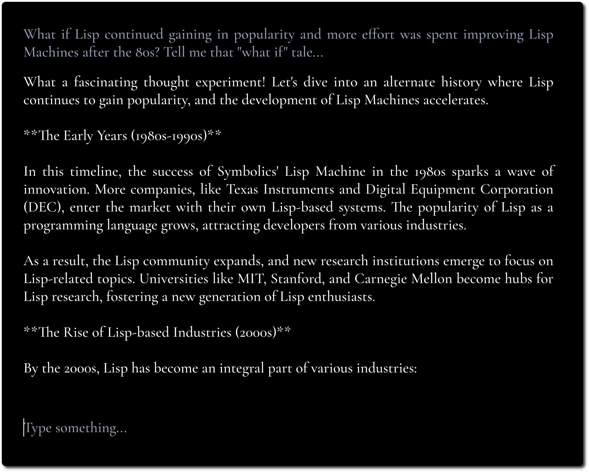

# MiniChat

A minimalistic LLM chat UI, inspired by [Fooocus](https://github.com/lllyasviel/Fooocus) and [Pi](https://pi.ai/).

If you have a CORS enabled API endpoint to use, you can try it [here](https://functorism.github.io/minichat/).

<p align="center">
    
    
</p>

The goal is to focus on the content and hide away as much tinkering and tweaking as possible.

We emphasize the content by using bold typography and minimal design.

## Configuration

We try to keep configuration minimal yet flexible.

MiniChat supports OpenAI compatible APIs, see the [Docker Compose](#docker-compose) section for running MiniChat
with various model providers by leveraging gateways such as Portkey.

<p align="center">
    
</p>

<p align="center">
    
</p>

## Docker

You can run MiniChat with Docker, the image is less than 2MB.

```
docker run -p 3216:3216 ghcr.io/functorism/minichat:master
```

## Docker Compose

### Ollama

Run

```
docker compose -f docker-compose-ollama.yml up
docker exec minichat-ollama-1 ollama pull llama3:8b
```

UI Settings:

- Model: llama3:8b
- OpenAI API URL: http://localhost:11434/v1
- API Key: unused-for-ollama

### Portkey

Run

```
docker compose -f docker-compose-portkey.yml up
```

UI Settings:

- Model: claude-3-5-sonnet-20240620
- OpenAI API URL: http://localhost:8080/http://portkey:8787/v1
- API Key: sk-...
- Headers
  - x-portkey-provider: anthropic

### HuggingFace Text Generation Inference

Run

```
docker compose -f docker-compose-tf-tgi.yml up
```

UI Settings:

- Model: HuggingFaceH4/zephyr-7b-beta
- OpenAI API URL: http://localhost:8080/v1
- API Key: unused-for-hf-tgi
- Headers
  - Check "Send Minimal Headers"
